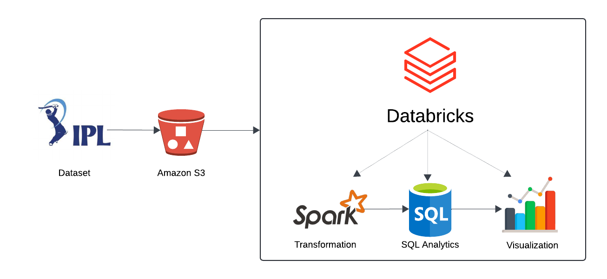

# IPL Data Analysis Project with Apache Spark

## Overview
This project analyzes IPL (Indian Premier League) cricket data by building a data pipeline using Apache Spark. The focus is on writing transformation logic with Spark, performing SQL-based data analysis, and visualizing insights. The IPL dataset is stored on Amazon S3, and Databricks is used as the development environment to run the Apache Spark code.

**Dataset source**: [IPL Data till 2017](https://data.world/raghu543/ipl-data-till-2017)

## Workflow

## Key Features
- **Data Storage**: IPL dataset uploaded and managed on Amazon S3 (Simple Storage Service).
- **Data Processing**: Apache Spark used to read and transform the dataset.
- **SQL Analytics**: SQL queries written to analyze IPL data and uncover trends.
- **Visualization**: Visualizations created to derive insights from the processed data.

## Summary
This data set has the ball by ball data of all the Indian Premier League (IPL) matches till 2017 season.

